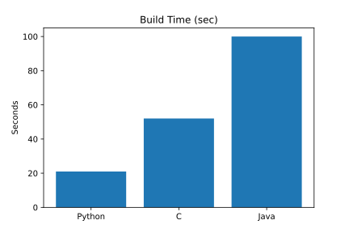
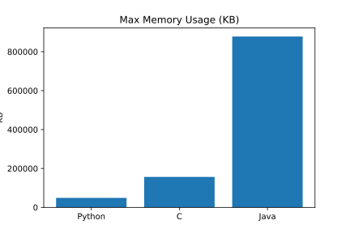
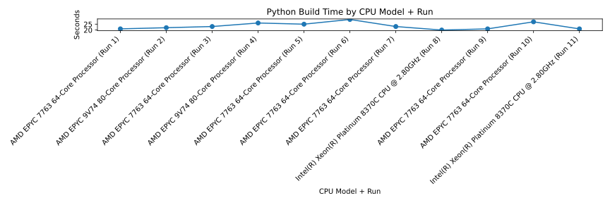
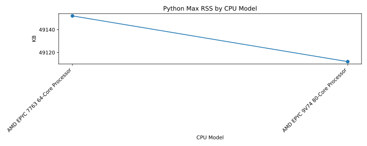
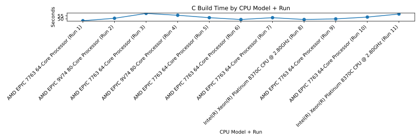
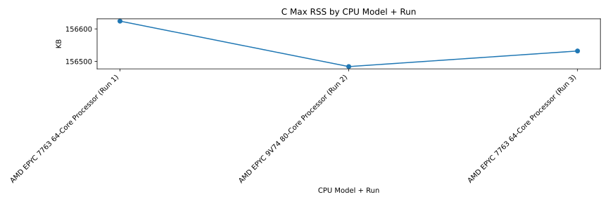
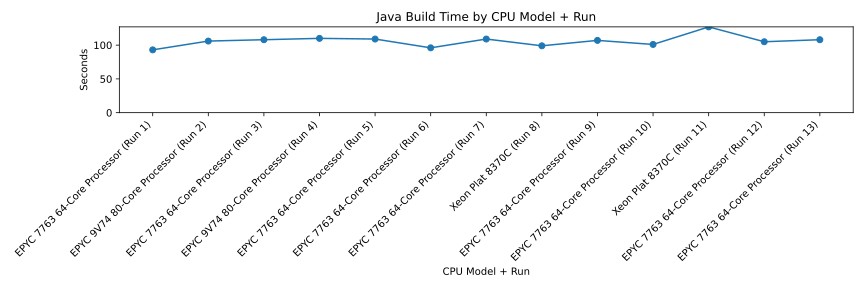
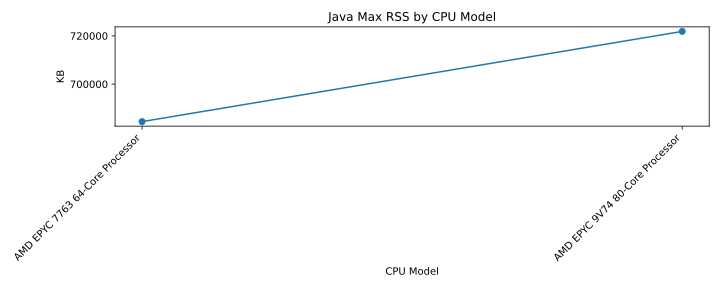

# Multi-Language Build Benchmark Report

## CPU Information

- **Model**: AMD EPYC 7763 64-Core Processor
- **Sockets**: 1
- **Cores per Socket**: 2
- **Logical CPUs**: 4

## Build Time (Current Run)



## Max Memory Usage (Current Run)



## CPU Model Based Trend Graphs

### Python Build Time by CPU Model



### Python Max RSS by CPU Model



### C Build Time by CPU Model



### C Max RSS by CPU Model



### Java Build Time by CPU Model



### Java Max RSS by CPU Model



## Raw Results (Current Run)

### Python

```json
{
  "language": "Python",
  "max_rss_kb": 49152,
  "build_time_sec": 21
}
```

### C

```json
{
  "language": "C",
  "max_rss_kb": 156624,
  "build_time_sec": 47
}
```

### Java

```json
{
  "language": "Java",
  "max_rss_kb": 684460,
  "build_time_sec": 93
}
```
