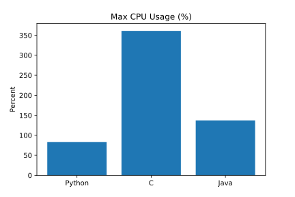
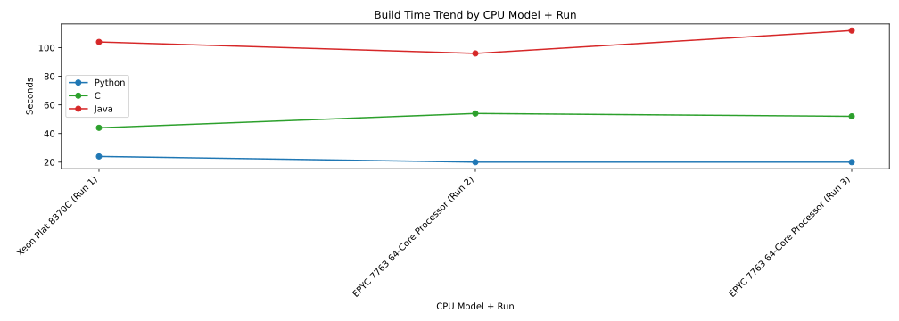
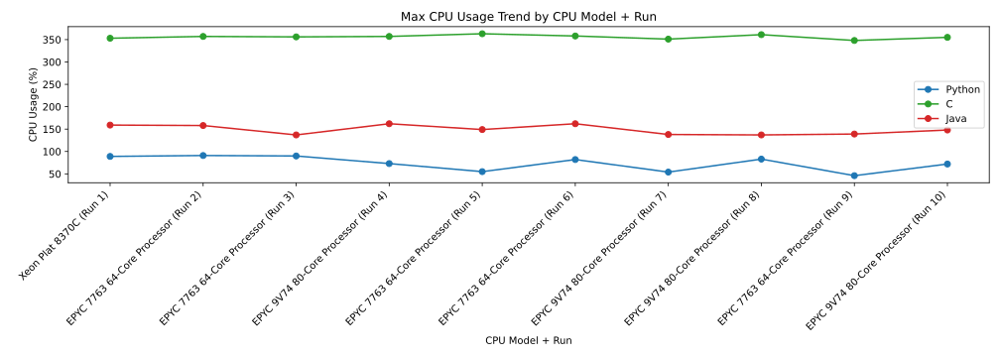
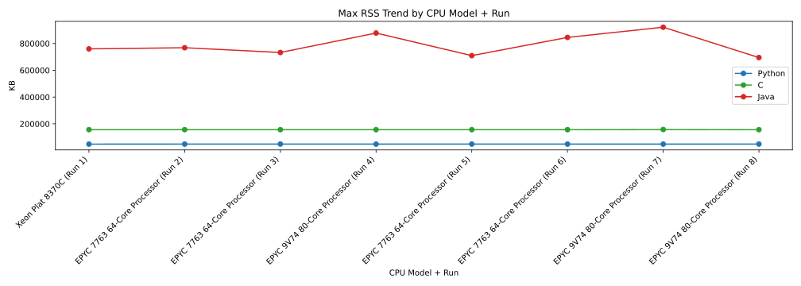

# Multi-Language Build Benchmark Report

## CPU Information (Current Run)

- **Model**: AMD EPYC 7763 64-Core Processor
- **Short Name**: EPYC 7763 64-Core Processor
- **Sockets**: 1
- **Cores per Socket**: 2
- **Logical CPUs**: 4

## Build Time (Current Run)


## Max Memory Usage (Current Run)


## Max CPU Usage (Current Run)



## Trend Graphs (Python + C + Java)

### Build Time Trend by CPU Model + Run



### Max CPU Usage Trend by CPU Model + Run



### Max RSS Trend by CPU Model + Run



## Raw Results (Current Run)

### Python

```json
{
  "language": "Python",
  "max_cpu_percent": 55,
  "max_rss_kb": 48920,
  "build_time_sec": 21
}
```

### C

```json
{
  "language": "Python",
  "max_cpu_percent": 363,
  "max_rss_kb": 156592,
  "build_time_sec": 52
}
```

### Java

```json
{
  "language": "Python",
  "max_cpu_percent": 149,
  "max_rss_kb": 709496,
  "build_time_sec": 100
}
```
