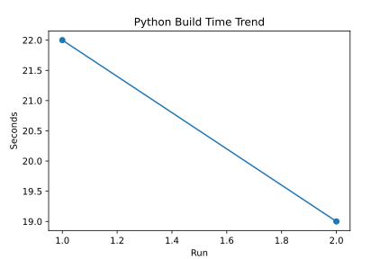
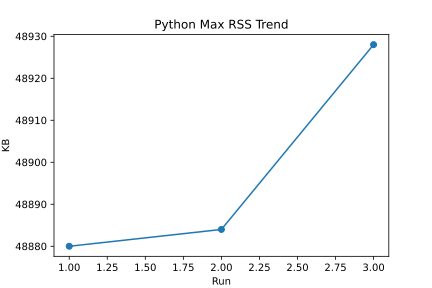
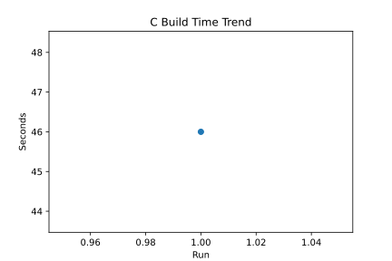
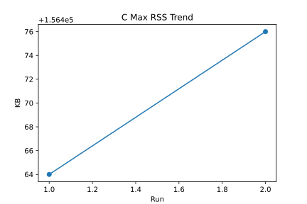
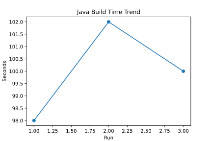
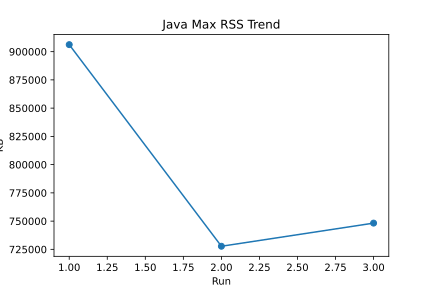

# Multi-Language Build Benchmark Report

## CPU Information

- **Model**: Intel(R) Xeon(R) Platinum 8370C CPU @ 2.80GHz
- **Sockets**: 1
- **Cores per Socket**: 2
- **Logical CPUs**: 4

## Build Time (Current Run)


## Max Memory Usage (Current Run)


## Trend Graphs

### Python Build Time Trend



### Python Max RSS Trend



### C Build Time Trend



### C Max RSS Trend



### Java Build Time Trend



### Java Max RSS Trend



## Raw Results (Current Run)

### Python

```json
{
  "language": "Python",
  "max_rss_kb": 48884,
  "build_time_sec": 26
}
```

### C

```json
{
  "language": "C",
  "max_rss_kb": 156548,
  "build_time_sec": 58
}
```

### Java

```json
{
  "language": "Java",
  "max_rss_kb": 727760,
  "build_time_sec": 102
}
```
